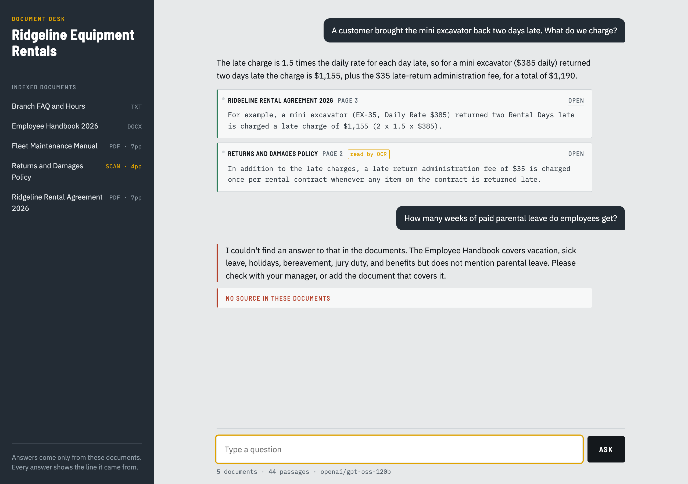
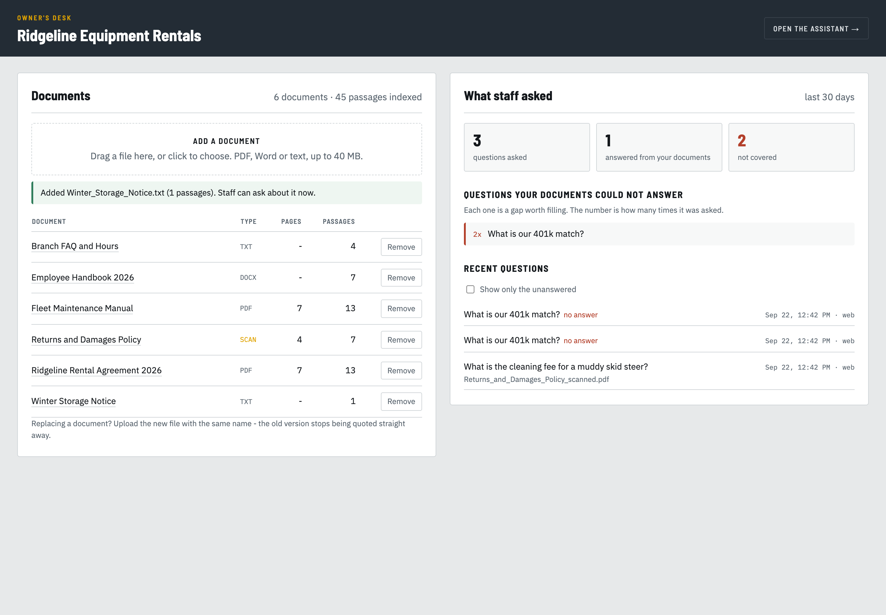

# Document Q&A Assistant

An AI assistant that answers staff questions from a company's PDFs and documents, citing the file and page for every answer, and saying "I don't know" when the documents don't cover it.

> Status: complete. See [`DEMO.md`](DEMO.md) for the recording script and [`HANDOFF.md`](HANDOFF.md) for the client handover template. See `PLAN.md` for the full plan.

## Setup

Requirements: macOS (or Linux), Python 3.12, Homebrew.

```bash
# 1. OCR program, used to read scanned PDFs
brew install tesseract

# 2. Python environment (inside the project folder)
python3.12 -m venv .venv
.venv/bin/python -m pip install -r requirements.txt

# 3. Settings
cp .env.example .env        # then fill in the values (see below)

# 4. Check everything works (first run downloads the ~130 MB embedding model)
.venv/bin/python scripts/check_env.py
```

## Environment variables (`.env`)

| Name | What it is | Needed from |
|---|---|---|
| `COMPANY_NAME` | Shown in the chat UI and refusal messages | always (has a default) |
| `DOCUMENTS_DIR` / `INDEX_DIR` | Where documents and the search index live | always (have defaults) |
| `EMBEDDING_MODEL` | Local embedding model | always (has a default) |
| `LLM_PROVIDER` | Which model answers: `groq` (default) or `gemini` | answering (M5) |
| `GROQ_API_KEY` / `GROQ_MODEL` | Groq key and model ID | answering (M5) |
| `GEMINI_API_KEY` / `GEMINI_MODEL` | Google AI Studio key and model, used as the fallback | optional |
| `TOP_K` / `RELEVANCE_THRESHOLD` | How many passages the LLM reads; the minimum match score before refusing | tuned at M6 |
| `LOG_QUESTIONS` / `ADMIN_PASSWORD` / `MAX_UPLOAD_MB` | The owner's desk: recording, password, upload limit | owner's desk |
| `TELEGRAM_BOT_TOKEN` | Token from @BotFather | Telegram |
| `TELEGRAM_ALLOWED_CHAT_IDS` | Comma-separated chat IDs allowed to use the bot. Empty means nobody. | Telegram |

`check_env.py` only ever prints SET / MISSING for these, never the values.

## Demo documents

The demo uses a fictional company, **Ridgeline Equipment Rentals**. Its documents are generated from editable text sources in `sample_data/source/`:

```bash
.venv/bin/python scripts/generate_demo_docs.py
```

| File in `documents/` | Format | Why it's in the demo |
|---|---|---|
| `Ridgeline_Rental_Agreement_2026.pdf` | PDF (text) | Rates, late charges, fuel, Damage Waiver |
| `Returns_and_Damages_Policy_scanned.pdf` | **Scanned PDF (images only)** | Proves OCR works: damage fees, admin fee, disputes |
| `Fleet_Maintenance_Manual.pdf` | PDF (text) | Service intervals, e.g. EX-35 hydraulic oil |
| `Employee_Handbook_2026.docx` | Word | Leave, pay, conduct. **No parental leave, on purpose.** |
| `Branch_FAQ_and_Hours.txt` | Plain text | Branch hours, payment methods |

`sample_data/demo_facts.md` lists the key facts planted in the documents and the topics that are deliberately missing (which the assistant must refuse). It is not indexed.

For a real client, delete the demo files and put their documents in `documents/`.

## Indexing the documents

```bash
.venv/bin/python scripts/ingest.py            # index what changed
.venv/bin/python scripts/ingest.py --force    # re-read everything (after changing chunk settings)
.venv/bin/python scripts/ingest.py --show 3   # also print example chunks
```

Run it whenever a document is added, replaced or deleted. It compares a fingerprint (SHA-256) of every file with the record in `index/manifest.json`, so unchanged documents are skipped and a second run takes under a second. A changed file has its old passages deleted before the new ones are added, so an out-of-date policy can never be quoted.

What happens to each document:
- **PDF:** one segment per page. A page with almost no text is treated as a scan, rendered at 300 dpi and read with OCR, so the page number is right either way.
- **DOCX / TXT:** one segment per heading section, since these formats have no fixed pages. Their citations show the section instead.
- Repeated headers and footers are dropped, and lines wrapped at the page margin are joined back into sentences, so a quote can be verified later.
- Chunks are about 300 words with a 50-word overlap, and **never cross a page**.

## Trying the search on its own

```bash
.venv/bin/python scripts/search.py "how much is the late return fee?"
.venv/bin/python scripts/search.py "EX-35 hydraulic oil" --k 3 --full
```

Search is **hybrid**: a vector search that matches meaning, plus a BM25 keyword search that matches exact strings such as `EX-35`, `A92.22` or `ISO VG 46`. The two rankings are merged with Reciprocal Rank Fusion. The command prints where each passage came from, which of the two searches found it, and both scores. Use it when an answer looks wrong, to tell a search problem from a wording problem.

## Asking questions

```bash
.venv/bin/python scripts/ask.py "how much do we charge for a late return?"
.venv/bin/python scripts/ask.py          # interactive, one question per line
```

Every answer passes three gates before it reaches the user:

1. **Nothing relevant found.** If the closest passage scores below `RELEVANCE_THRESHOLD`, the assistant refuses without calling the LLM at all.
2. **The model says it isn't there.** The prompt requires `"answerable": false` when the passages don't contain the answer, and names what the documents *do* cover instead.
3. **Citation check.** Every quote is looked up in the real passage. Quotes that can't be found are dropped, and an answer left with no verifiable quote becomes a refusal. What the user sees is the wording *from the document*, not the model's version of it.

### Which model answers, and the free-tier limits

Set `LLM_PROVIDER` in `.env`. Everything else — search, the gates, the citation checking — is identical either way, because both providers sit behind `app/llm.py`.

| Provider | Free-tier reality (measured 2026-09-21) | Use it when |
|---|---|---|
| `groq` (default) | **8,000 tokens a minute, 200,000 a day** — about 100 questions or 2 evaluation runs a day. Fast and steady, usually 1–3 seconds. | Everything: normal use, demos and evaluation runs. |
| `gemini` | **Only 20 requests a day per model**, and often returns "busy" because free accounts are deprioritised. Each model has its own 20, so switching model buys another 20. | A fallback when Groq's daily budget runs out mid-demo. |

Neither limit exists on a paid account; see the costs write-up below.

A question with 4 passages costs about 2,000 tokens. If a limit is hit, the assistant waits and retries automatically: a couple of seconds for a busy provider, and for a quota refusal, exactly as long as the provider asks. After 4 attempts it shows "temporarily unavailable" rather than an error.

**Taking this to a real company** — what changes at 50 documents, what to ask before quoting, and the settings to revisit: [`docs/real-client-notes.md`](docs/real-client-notes.md). Phase 4's HANDOFF template draws on it.

**Costs for a real client** (a few dollars a month, not free-tier pain) and the measured limits behind the table above are written up in [`docs/costs-and-limits.md`](docs/costs-and-limits.md) — useful on a sales call.

Two settings worth knowing:
- `TOP_K` — passages per question. Lower is cheaper, higher gives more context.
- `GEMINI_MODEL` — Google retires models fairly often, and `gemini-2.5-flash` is already closed to new accounts. If a 404 says the model is gone, put the replacement it names here.

## The web chat

```bash
./scripts/start.sh            # starts the server and opens the browser
./scripts/start.sh admin      # opens the owner's desk instead
./scripts/start.sh 8080       # a different port
```

Or run the server directly:

```bash
.venv/bin/uvicorn app.web:api --port 8000
```



- The left rail lists the documents the assistant can see, with a **SCAN** badge on scanned files, so nobody has to guess what is indexed. Each name opens the file.
- Answers carry **source tags**: the document, the page or section, and the exact line, with an **Open** link that jumps to that page of the PDF. A tag from a scanned file is marked *read by OCR*.
- A refusal is shown against a red bar with **No source in these documents**, borrowing the yard's own tag system (the maintenance manual red-tags a machine that must not be rented).
- Four example questions sit on the opening screen, including one the documents cannot answer, so a demo can be clicked rather than typed.
- Works down to phone width, and nothing technical is shown: no stack traces, no JSON, no debug output.

The page is three files (`static/index.html`, `style.css`, `app.js`) with no framework and no build step, so a client's own developer can read it.

## The owner's desk

```
http://localhost:8000/admin
```



So the owner never has to ask anyone for the two things that recur:

- **Documents.** Drag a file in to add it, and it is indexed straight away, so staff can ask about it seconds later. Remove one and its passages go with it, so an old policy can never be quoted again. Uploading a file with the same name replaces it.
- **What staff asked**, and more usefully, **the questions the documents could not answer**, grouped and counted. "What's our parental leave policy?" asked eleven times is not an AI problem; it is a missing page in the handbook.

Settings:

| Setting | Effect |
|---|---|
| `LOG_QUESTIONS` | `false` stops questions being recorded at all. Everything is stored locally in `index/questions.db`, and nothing leaves the machine. |
| `ADMIN_PASSWORD` | If set, the page and every owner endpoint ask for it. **Empty means open**, which is fine on a personal laptop and not fine on a network. |
| `MAX_UPLOAD_MB` | Largest file accepted through the browser (default 40). |

Uploads accept PDF, Word and text only; names are stripped of any path before anything is written.

## Telegram

The same assistant on a phone, for staff who are in the yard rather than at a desk.

```bash
.venv/bin/python -m app.telegram_bot
```

Setup:
1. Create a bot with **@BotFather** in Telegram (`/newbot`) and put the token in `.env` as `TELEGRAM_BOT_TOKEN`.
2. Start the bot, message it from your phone, and its log prints your chat ID.
3. Put that ID in `TELEGRAM_ALLOWED_CHAT_IDS` (comma-separated for several people) and restart.

Notes worth knowing:
- **Only listed chats get answers.** Anyone else is turned away before any search happens, and their ID is logged so you can add them. An empty list allows nobody, not everybody — a bot is findable, and company documents should not be.
- It uses **long polling**, so no public address, no tunnel and no open port. It runs from a laptop for a demo and from the client's own machine afterwards, but only while that machine is on. Always-on hosting is a Premium item.
- Answers carry the same citations as the web chat, with a *(read by OCR)* note for scanned files. Greetings get a welcome rather than a refusal.

## Proving it works: the evaluation set

`eval/questions.yaml` holds 20 questions: 15 the documents can answer and 5 they cannot. The unanswerable five are the point of the exercise, since they are what separates an assistant a business can trust from one that invents figures confidently.

```bash
.venv/bin/python eval/run_eval.py                  # full run, saves a Markdown report
.venv/bin/python eval/run_eval.py --no-judge       # skip grading (faster, fewer tokens)
.venv/bin/python eval/run_eval.py --only late-return,sick-days
.venv/bin/python eval/run_eval.py --threshold-scan # what each refusal threshold would do
```

What is measured:

| Measure | Meaning |
|---|---|
| Retrieval hit rate | Was the document holding the answer found at all? If this is low, no prompt can fix the answer. |
| Answer correctness | Does the answer say what the document says? Graded by a second model call against the expected answer. |
| Correct refusals | Of the questions the documents cannot answer, how many were refused. This is the trust number. |
| False refusals | Answerable questions it refused anyway: the cost of being careful. |
| Citations on target | Did it cite the document the answer actually came from? |

Each run writes a full report to `eval/results/`, question by question, which is the thing to show a client who asks how accurate it is. A run makes about 35 model calls and takes a few minutes on the free tier, because it waits out the rate limit instead of failing.

## Recording the demo, and resetting between takes

```bash
.venv/bin/python scripts/reset_demo.py          # rebuild documents, re-index, check the demo beats
.venv/bin/python scripts/reset_demo.py --check  # say what it would do, change nothing
```

The reset rebuilds the five demo documents from their text sources, deletes the index, re-indexes, and then **asks the four questions the demo depends on** to confirm they still give the scripted answers. It never touches `.env`.

[`DEMO.md`](DEMO.md) is the click-by-click script for a 75-90 second recording, with what to say over each step and what to do if something goes wrong mid-take.

## Running it with Docker (how a client gets it)

```bash
cp .env.example .env     # add their key, company name and ADMIN_PASSWORD
docker compose up -d --build
docker compose exec assistant python scripts/ingest.py
```

The image is about 720 MB and builds in under 7 minutes. One command instead of installing Python, Tesseract and a dozen libraries by hand, and it behaves the same on Mac, Windows and Linux. Their `documents/` folder and the index stay **outside** the container, so a new version never touches their files, and `restart: unless-stopped` brings it back after a reboot.

Full install guide, day-to-day commands, what to check before leaving a client's office, and how to explain it to them in plain words: [`docs/deploying-with-docker.md`](docs/deploying-with-docker.md).

## Tests

```bash
.venv/bin/python -m pytest -q
```

29 tests, none of which need an API key or the network. They cover the rules everything else rests on: chunks never crossing a page, invented quotes being dropped, an unreachable model never being scored as a refusal, and the Telegram allowlist refusing an empty list.

## Known limitations

- **Word and text files have no page numbers.** Their citations name the section instead, e.g. "5.2 Sick leave". Inventing a page number would be worse.
- **OCR quality depends on the scan.** The demo's scanned file is machine-generated and clean; a phone photo or a faxed page will read less accurately.
- **Handwriting, images and charts are not read.** Only text.
- **A chunk can span two short sections** in Word and text files, so the section label is where the quote starts.
- **Free-tier limits apply.** Roughly 100 questions a day on Groq's free tier. See [`docs/costs-and-limits.md`](docs/costs-and-limits.md).
- **Telegram runs only while the program runs**, on your machine. Always-on hosting is a Premium item.
- **One bot instance per token.** Starting a second copy stops itself with a message; Telegram allows only one.
- **English only**, as indexed and prompted today.
- **The owner's page is open unless `ADMIN_PASSWORD` is set.** It can add and delete documents, so set one before the assistant is reachable by anyone else.
- **Questions are recorded locally** (`index/questions.db`) unless `LOG_QUESTIONS=false`. Tell the client, since staff questions can be personal.
- Starting the environment check prints a Hugging Face warning about unauthenticated downloads. It is harmless.
