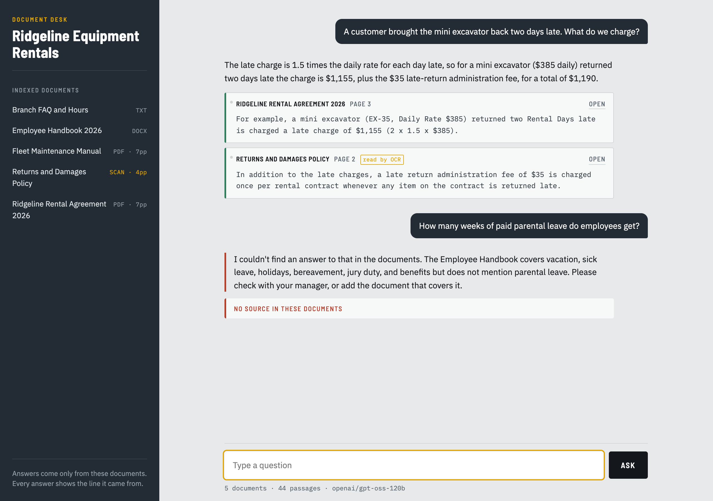
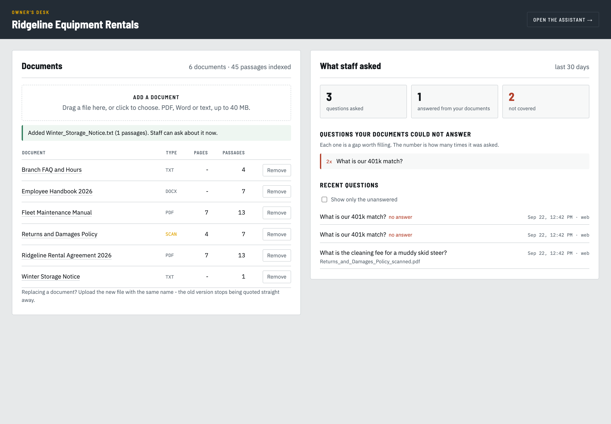

# Document Q&A Assistant

A chat assistant that answers questions from a company's own documents (PDF, Word, text). Every answer shows which file and page it came from. If the answer isn't in the documents, it says it doesn't know instead of making something up.



## Features

- Answers with the source file, page and the exact quote, with a link that opens the PDF on that page
- Refuses questions the documents don't cover
- Reads scanned PDFs with OCR
- Web chat and a Telegram bot (only approved users can use the bot)
- Admin page to upload or delete documents and see what staff asked, including the questions it couldn't answer



## Demo

The demo runs on a made-up equipment rental company, Ridgeline Equipment Rentals, with 5 documents: a rental agreement, a scanned returns policy, a maintenance manual, an employee handbook and a branch FAQ. A few topics are missing from the documents on purpose, to show it refusing.

## Test results

I tested it with 20 questions, 15 that the documents answer and 5 that they don't.

- Found the right document: 14 of 15
- Correct answers: 9 of 15, and 6 more partly correct
- Refused all 5 questions it couldn't answer, with no made-up answers
- Didn't refuse any question it should have answered

## Running it

With Docker:

```bash
cp .env.example .env
docker compose up -d --build
docker compose exec assistant python scripts/ingest.py
```

Fill in the API key, company name and admin password in `.env` first. The chat is at http://localhost:8000 and the admin page at http://localhost:8000/admin.

More in [docs/deploying-with-docker.md](docs/deploying-with-docker.md). Costs are in [docs/costs-and-limits.md](docs/costs-and-limits.md).

## Limitations

- Word and text files don't have pages, so those answers show the section name instead
- Bad scans or phone photos won't read as well
- Doesn't read handwriting, images or charts
- English only
- The free AI plan allows around 100 questions a day
